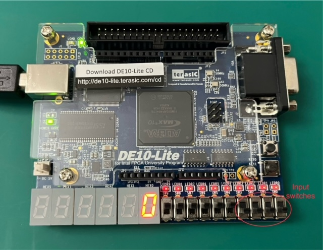
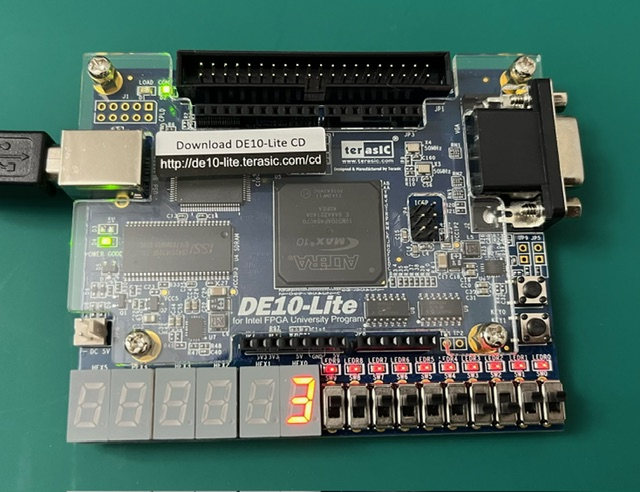
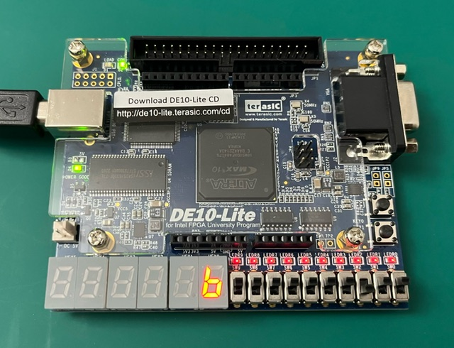
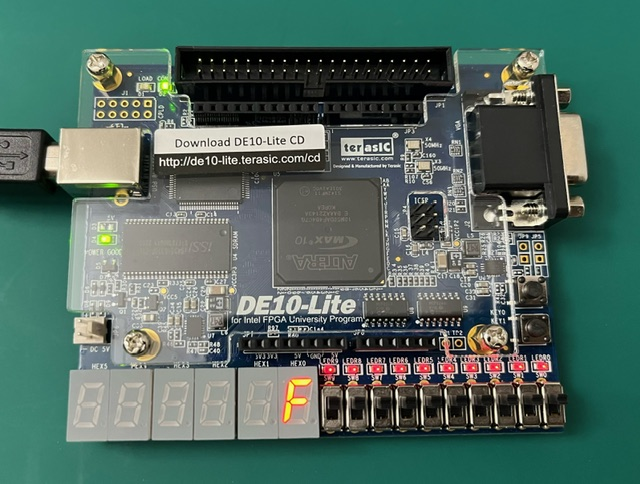
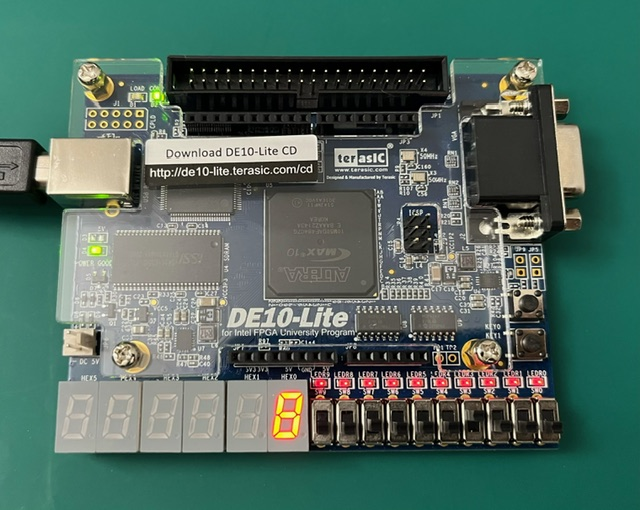

# Seven Segment Decoder
This project implements a seven-segment decoder using Verilog on the DE10-Lite FPGA board. The decoder converts binary inputs into outputs that light up a seven-segment display.

The 4 rightmost switches are utilized as inputs, all the other switches are disabled.

The input switches represent a four-bit binary number, representing the hexadecimal digit 0 through F. For example, 0000=0, 0011=3, 0101=5, 1101=D, etc.

 

    
    
    
    
    

